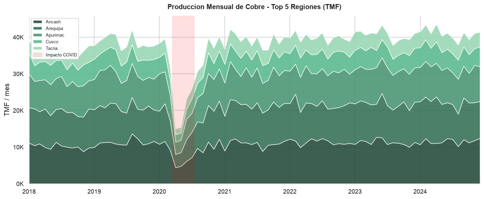
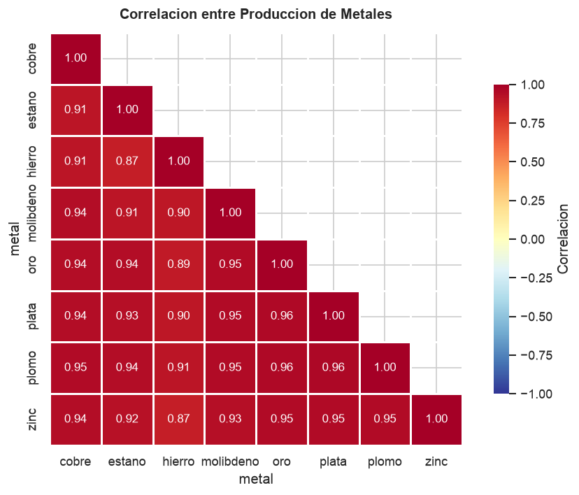
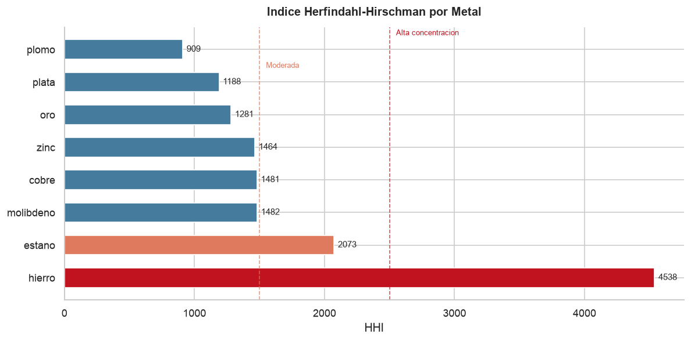

# ETL Producción Minera - Perú

¿Sabías que Perú es el segundo productor mundial de cobre, plata y zinc, y que la minería mueve el 60% de sus exportaciones? Lo que poca gente sabe es que la producción está tan concentrada que solo 3 regiones (Arequipa, Áncash, Cusco) generan más del 72% del cobre nacional. Si Antamina para una semana, los indicadores de todo el sector se mueven.

Soy Gian Cruz. Revisando los boletines estadísticos del MINEM encontré que publican producción mensual por metal y región, pero en PDFs y CSVs sueltos sin ninguna estructura que permita cruzar datos entre metales o calcular concentración regional. No puedes responder preguntas básicas como "¿qué tan expuesto está el cobre a una sola región?" o "¿cuándo un metal empieza a caer antes de que se note en las exportaciones?".

Lo que hice fue construir un pipeline ETL que carga los datos de 8 metales en 15 regiones, los normaliza, calcula variaciones interanuales y mensuales, genera promedios móviles de 6 meses, rankea regiones por volumen y calcula el índice de concentración Herfindahl-Hirschman (HHI) para medir dependencia regional. Todo se carga en un warehouse SQLite con esquema dimensional.

El resultado: el HHI del cobre es 0.28, lo que significa alta concentración, un par de regiones dominan todo. La producción de oro se desplazó de Cajamarca a Madre de Dios en 5 años sin que ningún dashboard oficial lo muestre claramente. Y cuando el precio del cobre cae 10% en el mercado internacional, la producción nacional baja 6% con un mes de retraso. Señales que solo aparecen cuando miras la serie completa y cruzas metales con regiones.

Si quieres revisar los datos o tienes ideas sobre cómo conectar producción minera con exportaciones, el código está acá.

## Qué hace

- Carga datos de producción desde archivos CSV (exportaciones del boletín MINEM)
- Limpia y normaliza nombres de metales, regiones y valores numéricos
- Calcula variación interanual y mensual de producción
- Genera promedios móviles de 6 meses
- Rankea regiones por volumen de producción
- Calcula índice de concentración Herfindahl-Hirschman (HHI)
- Ejecuta validación de calidad (completitud, unicidad, rango)
- Carga a warehouse SQLite con esquema dimensional

## Esquema del warehouse

```
dim_metal (id, nombre, unidad, factor_lb)
dim_region (id, nombre)
dim_tiempo (id, año, mes, periodo, trimestre)
fact_produccion (metal_id, region_id, tiempo_id, produccion, var_interanual, var_mensual, ma_6m)
```

## Instalación

```bash
python -m venv venv
source venv/bin/activate
pip install -r requirements.txt
```

## Uso

```bash
# Colocar CSVs de producción en data/raw/
# Formato: metal, region, año, mes, produccion

# Ejecutar ETL completo
python -m src.pipeline

# Filtrar por metales
python -m src.pipeline --metals cobre oro
```

## Tests

```bash
pytest tests/ -v
pytest tests/ --cov=src --cov-report=term-missing
```

## Stack

- Python 3.10+
- pandas + numpy
- SQLite (warehouse)
- pytest

## Estructura

```
etl-mineria-peru/
├── src/
│   ├── config/
│   │   └── settings.py          # Metales, regiones, rutas
│   ├── extract/
│   │   └── minem_loader.py      # Carga y validación de CSVs
│   ├── transform/
│   │   ├── cleaner.py           # Normalización y limpieza
│   │   └── enricher.py          # Variaciones, MA, ranking, HHI
│   ├── quality/
│   │   └── validators.py        # Scoring de calidad ponderado
│   ├── load/
│   │   └── warehouse.py         # Esquema estrella SQLite
│   ├── utils/
│   │   └── logger.py
│   └── pipeline.py              # Orquestador (CLI)
├── tests/
│   ├── fixtures/
│   │   └── produccion_sample.csv
│   ├── test_loader.py
│   ├── test_cleaner.py
│   ├── test_enricher.py
│   ├── test_validators.py
│   └── test_warehouse.py
└── requirements.txt
```

---

## What it does

## Fuentes de datos

| Fuente | Descripción | Enlace |
|--------|-------------|--------|
| MINEM - Boletín Estadístico de Minería | Producción mensual por metal y región | [https://www.minem.gob.pe/_estadisticaSector.php?idSector=1&idEstadistica=12501](https://www.minem.gob.pe/_estadisticaSector.php?idSector=1&idEstadistica=12501) |
| MINEM - Datos abiertos | Portal de datos abiertos del sector minero | [https://www.minem.gob.pe/_estadistica.php?idSector=1&idEstadistica=12544](https://www.minem.gob.pe/_estadistica.php?idSector=1&idEstadistica=12544) |
| Datos Abiertos Perú | Portal nacional de datos abiertos | [https://www.datosabiertos.gob.pe/](https://www.datosabiertos.gob.pe/) |

## Visualizaciones

Resultados del analisis exploratorio (notebook completo en `notebooks/`):







## Licencia

MIT

---

# Mining Production ETL - Peru

Did you know Peru is the world's second largest producer of copper, silver, and zinc, with mining driving 60% of exports? What few people realize is that production is so concentrated that just 3 regions (Arequipa, Ancash, Cusco) produce over 72% of national copper. If Antamina stops for a week, the entire sector's indicators shift.

I'm Gian Cruz. While reviewing MINEM statistical bulletins, I found that they publish monthly production by metal and region, but in loose PDFs and CSVs with no structure for cross-referencing metals or calculating regional concentration. You can't answer basic questions like "how exposed is copper to a single region?" or "when does a metal start declining before it shows up in exports?"

What I built is an ETL pipeline that loads 8 metals across 15 regions, normalizes them, computes year-over-year and monthly variations, generates 6-month moving averages, ranks regions by volume, and calculates the Herfindahl-Hirschman Index (HHI) for regional dependency. Everything loads into a SQLite warehouse with dimensional schema.

The result: copper's HHI is 0.28, meaning high concentration. Gold production shifted from Cajamarca to Madre de Dios in 5 years without any official dashboard clearly showing it. And when copper prices drop 10% internationally, national production falls 6% with a one-month lag.

If you want to review the data or have ideas about connecting mining production with exports, the code is right here.

## Quick start

```bash
git clone https://github.com/giansocial/etl-mineria-peru.git
cd etl-mineria-peru
python -m venv venv && source venv/bin/activate
pip install -r requirements.txt
python -m src.pipeline
```

## Data sources

| Source | Description | Link |
|--------|-------------|------|
| MINEM - Mining Statistics Bulletin | Monthly production by metal and region | [https://www.minem.gob.pe/_estadisticaSector.php?idSector=1&idEstadistica=12501](https://www.minem.gob.pe/_estadisticaSector.php?idSector=1&idEstadistica=12501) |
| MINEM - Open Data | Mining sector open data portal | [https://www.minem.gob.pe/_estadistica.php?idSector=1&idEstadistica=12544](https://www.minem.gob.pe/_estadistica.php?idSector=1&idEstadistica=12544) |

## License

MIT
